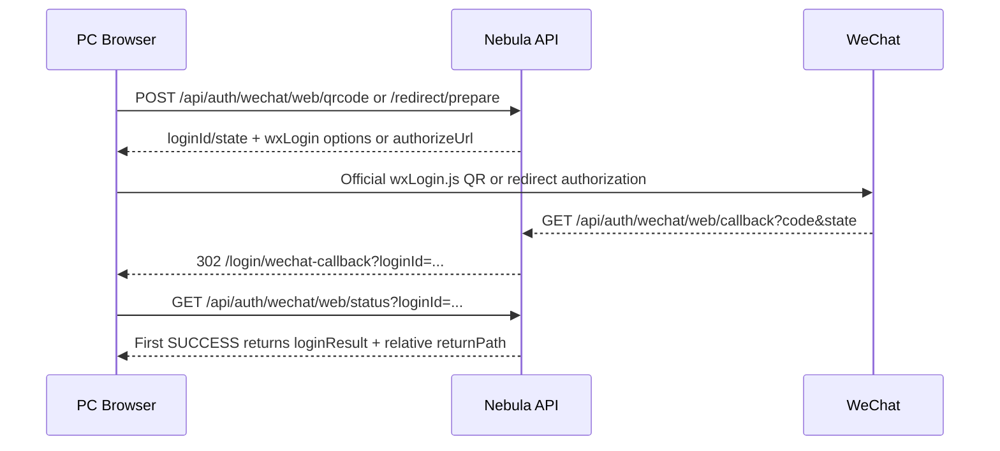

# Nebula Web

Nebula Web is a React middle-platform shell package built on Ant Design and React Router. Consumers wrap their app with `NebulaProvider`, then render either `NebulaLayout` directly or a router created by `createNebulaRouter`.

## Brand configuration

Brand information is an app startup concern. Package consumers should provide overrides through `NebulaProvider` before rendering the app:

```tsx
import { NebulaProvider, createNebulaRouter } from 'nebula-web';
import { RouterProvider } from 'react-router-dom';
import { AcmeLogo } from './acme-logo';

const router = createNebulaRouter({
  routes,
  menuItems,
});

export function App() {
  return (
    <NebulaProvider
      brand={{
        name: 'Acme Console',
        title: 'Acme Console',
        logo: <AcmeLogo />,
        faviconHref: '/favicon.svg',
      }}
    >
      <RouterProvider router={router} />
    </NebulaProvider>
  );
}
```

### Brand fields

| Field | Purpose | Fallback |
| --- | --- | --- |
| `name` | Brand name shown by `NebulaLayout` when no local `title` is provided. | `Nebula Web` |
| `title` | Browser tab title synchronized by `NebulaProvider`. | `name` |
| `logo` | Brand logo shown by `NebulaLayout` when no local `logo` is provided. | Built-in placeholder icon |
| `faviconHref` | Browser favicon link href synchronized by `NebulaProvider`. | Existing page favicon remains unchanged |

`createNebulaRouter` does not accept brand configuration. It only owns route and menu creation. The `NebulaLayout` rendered by the router reads brand defaults from the surrounding `NebulaProvider` context.

## Local layout overrides

For one-off shells, `NebulaLayout` can still override the provider defaults locally:

```tsx
<NebulaProvider brand={{ name: 'Acme Console', logo: <AcmeLogo /> }}>
  <NebulaLayout title="Operations Console" logo={<OpsLogo />} menuItems={menuItems}>
    <Routes>{/* pages */}</Routes>
  </NebulaLayout>
</NebulaProvider>
```

Use local `title` and `logo` only when that layout instance should intentionally differ from the app-wide startup brand.

## Minimal provider setup

```tsx
import { NebulaProvider } from 'nebula-web';

export function AppRoot() {
  return (
    <NebulaProvider>
      <App />
    </NebulaProvider>
  );
}
```

Without `brand`, Nebula Web uses its built-in defaults.

## WeChat Web Login

The browser does not store WeChat AppSecret values or build WeChat authorization URLs from environment variables. It consumes the typed backend QR or redirect preparation response, then uses the returned `appId`, `scope`, `redirectUri`, `state`, and `loginId` with the official `wxLogin.js` flow.

Only the API proxy target is configured locally:

```env
VITE_API_BASE_URL=http://localhost:9999
```

The backend owns these deploy-time values under `nebula.auth.oauth2.providers.wechat-web`: `client-id`, `client-secret`, `scope`, `redirect-uri`, `frontend-callback-uri`, `frontend-callback-allowlist`, and `multi-instance`.

### Browser Flow



### Frontend Responsibilities

| Concern | Browser behavior |
| --- | --- |
| QR mode | Render the official `wxLogin.js` widget with backend-provided `appId`, `scope`, `redirectUri`, and `state`; do not render `qrCodeUrl` as an image. |
| Redirect mode | Call `/api/auth/wechat/web/redirect/prepare` and navigate to the returned `authorizeUrl`. |
| Callback route | Keep `/login/wechat-callback` public, read only `loginId`/`error`, then claim status once. |
| Token handling | Save tokens only from `status.loginResult`; tokens must never appear in URL query, hash, logs, or `.env`. |
| Return path | Navigate only to the relative `returnPath` returned by the first successful status claim; ignore callback query return paths. |
| Errors | Render deterministic terminal states for missing `loginId`, provider errors, expired sessions, failed sessions, and consumed results. |

For local development, point `VITE_API_BASE_URL` at either the monolith (`http://localhost:8080`) or the gateway (`http://localhost:9999`). Real WeChat testing requires externally reachable, reviewed callback domains; localhost is only suitable for deterministic mocks and backend unit tests.
